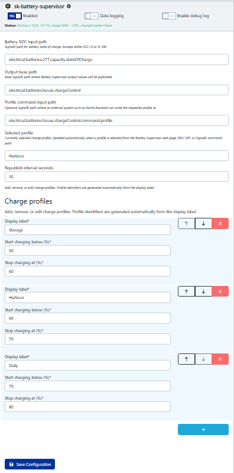
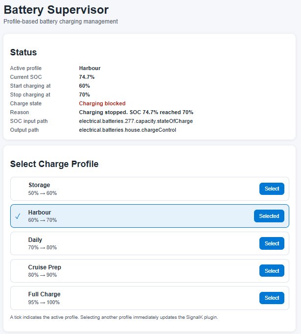
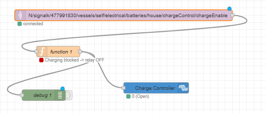

# Battery Supervisor for SignalK

Battery Supervisor is a SignalK plugin that provides profile-based battery charging supervision using configurable State of Charge (SOC) thresholds.

The plugin evaluates battery SOC against user-defined charge profiles and publishes the resulting charging state to SignalK paths for use by external automation systems.

Battery Supervisor is intentionally **hardware-agnostic**. It does not directly control chargers, relays, MPPTs, inverters, or battery management systems. Instead, it acts as a supervisory decision engine that publishes battery management information which can then be consumed by other systems.

---

# Features

- Configurable battery SOC input path
- Multiple user-defined charge profiles
- Automatic profile identifier generation
- Profile selection persistence across restarts
- Profile switching through:
  - Battery Supervisor web UI
  - REST API
  - SignalK command path
- Hysteresis-based charge enable logic
- Published SignalK charge-control paths
- Human-readable state and reason reporting
- Hardware-independent architecture

---

# Supported Charge Profiles

| Profile | Start Charging Below | Stop Charging At |
|----------|----------|----------|
| Storage | 50% | 60% |
| Harbour | 60% | 70% |
| Daily | 70% | 80% |
| Cruise Prep | 80% | 90% |
| Full Charge | 95% | 100% |

Users can freely add, edit, remove, or reorder profiles.

Profile identifiers are automatically generated from the display label.

| Display Label | Generated ID |
|---------------|-------------|
| Storage | storage |
| Harbour | harbour |
| Daily | daily |
| Cruise Prep | cruise-prep |
| Full Charge | full-charge |

---

# How Battery Supervisor Works

Battery Supervisor continuously monitors a configured battery SOC value and compares it against the currently selected charge profile.

Each profile contains:

- Minimum SOC threshold
- Maximum SOC threshold

Charging is controlled using hysteresis logic.

---

# Design Philosophy

Battery Supervisor is intended to be a reusable battery supervision layer.

It publishes charging decisions into SignalK but leaves actual hardware control to external systems.

Examples include:

- Victron Cerbo GX
- Home Assistant
- Node-RED
- MQTT consumers
- SignalK plugins
- Custom automation scripts
- Future JK BMS integrations

---

# Published SignalK Paths

Default output base path:

```text
electrical.batteries.house.chargeControl
```

Published values:

| Path | Description |
|--------|--------|
| profile | Active profile identifier |
| profileLabel | Active profile display name |
| availableProfiles | Available profile identifiers |
| availableProfileLabels | Available profiles with thresholds |
| minSoc | Active profile minimum SOC |
| maxSoc | Active profile maximum SOC |
| soc | Current battery SOC |
| chargeEnable | Charging permission state |
| state | charging_allowed or charging_blocked |
| reason | Human-readable explanation |
| lastProfileChangeSource | Origin of last profile change |
| lastUpdate | Timestamp of last update |

---

# Example: Victron Cerbo GX Integration

```text
JK BMS
   │
   ▼
SignalK
   │
   ▼
Battery Supervisor
   │
   ├── chargeEnable
   ├── profile
   ├── profileLabel
   │
   ▼
Node-RED / MQTT / Home Assistant
   │
   ▼
Cerbo GX
```

Battery Supervisor determines whether charging should be allowed. External systems consume the published SignalK values and apply the required hardware actions, including DVCC limits, charger control, relay control, MPPT control, and inverter control.

---

# Configuration
# Configuration

Battery Supervisor must be configured with a valid battery State of Charge (SOC) source before it can operate.

## Battery SOC Input Path

Select the SignalK path that contains the battery SOC value.

Example:

```text
electrical.batteries.house.capacity.stateOfCharge
```

Battery Supervisor accepts either:

```text
0.0 - 1.0
```

or:

```text
0 - 100
```

SOC formats and automatically normalises them to a percentage value.

---

## Output Base Path

Default:

```text
electrical.batteries.house.chargeControl
```

Battery Supervisor publishes all output values beneath this path.

Examples:

```text
electrical.batteries.house.chargeControl.profile
electrical.batteries.house.chargeControl.profileLabel
electrical.batteries.house.chargeControl.chargeEnable
electrical.batteries.house.chargeControl.reason
```

---

## Profile Command Input Path

Default:

```text
electrical.batteries.house.chargeControl.command.profile
```

External systems can write a profile ID to this path to change the active charge profile.

Examples:

```text
storage
harbour
daily
cruise-prep
full-charge
```

This allows profile changes from:

- Home Assistant
- Node-RED
- MQTT automation
- Custom SignalK applications

---

## Republish Interval

Default:

```text
30 seconds
```

Battery Supervisor republishes its current state at the configured interval, even when no SOC changes occur.

This ensures external systems remain synchronised with the current battery-management state.

---

## Charge Profiles

Profiles define the SOC operating window used by Battery Supervisor.

Each profile contains:

```text
Profile Name
Start Charging Below (%)
Stop Charging At (%)
```

Example:

| Profile | Start Charging Below | Stop Charging At |
|----------|----------|----------|
| Daily | 70% | 80% |
| Cruise Prep | 80% | 90% |

Users may freely:

- Add profiles
- Remove profiles
- Rename profiles
- Reorder profiles

Profile identifiers are generated automatically from the display label.

Examples:

| Display Label | Generated ID |
|---------------|-------------|
| Storage | storage |
| Harbour | harbour |
| Daily | daily |
| Cruise Prep | cruise-prep |
| Full Charge | full-charge |

---

## Example Configuration

| Setting | Example |
|----------|----------|
| Battery SOC Input Path | `electrical.batteries.house.capacity.stateOfCharge` |
| Output Base Path | `electrical.batteries.house.chargeControl` |
| Profile Command Input Path | `electrical.batteries.house.chargeControl.command.profile` |
| Republish Interval | `30` |
| Active Profile | `Daily` |

---

### SignalK Plugin Configuration



---

# Profile Selection

Profiles may be selected using:

- Battery Supervisor Web UI
- REST API
- SignalK command path

Default command path:

```text
electrical.batteries.house.chargeControl.command.profile
```

Examples:

```text
storage
harbour
daily
cruise-prep
full-charge
```
### Battery Supervisor Web Interface


---

## Proven Cerbo GX Integration

Battery Supervisor has been successfully validated with a Victron Cerbo GX using Node-RED.

Example flow:

Battery Supervisor
→ chargeEnable
→ MQTT
→ Node-RED
→ Cerbo GX Relay 2

When charging is permitted, Relay 2 is closed.
When charging is blocked, Relay 2 is opened.

This demonstrates the intended architecture where Battery Supervisor acts as a supervisory decision engine while external systems remain responsible for hardware control.

### Cerbo GX Relay Integration (Node-RED)



---

# Future Roadmap

- JK BMS RS485 integration
- Cell voltage monitoring
- Dynamic charge current limiting
- Dynamic discharge current limiting
- Cell balancing awareness
- Victron DVCC integration
- Relay control outputs
- MPPT supervisory control
- Advanced battery protection logic

---

# Future Roadmap

- JK BMS RS485 integration
- Cell voltage monitoring
- Dynamic charge current limiting
- Dynamic discharge current limiting
- Cell balancing awareness
- Victron DVCC integration
- Relay control outputs
- MPPT supervisory control
- Advanced battery protection logic

---

# Changelog
## v0.3.3

### Documentation

- Corrected README screenshot references.
- Fixed image paths to ensure screenshots render properly on GitHub and npm.
- Improved visual documentation layout and presentation.

### No Functional Changes

This release contains documentation-only updates and does not modify plugin functionality.

---

## v0.3.2

### Documentation

- Added detailed configuration guide.
- Added Battery SOC input path documentation.
- Added Output Base Path documentation.
- Added Profile Command Path documentation.
- Added Republish Interval documentation.
- Added charge profile configuration examples.
- Added example SignalK configuration.
- Added screenshots section to the README.
- Expanded Cerbo GX integration documentation.
- Improved onboarding and setup guidance for new users.

### No Functional Changes

This release contains documentation-only updates and does not modify plugin functionality.

## v0.3.1

### Added

- Automated plugin test suite using Node.js built-in test runner
- Selected profile display in SignalK configuration

### Changed

- Replaced hardcoded profile fallback logic with first-profile fallback
- Added persistent profile selection across restarts
- Separated internal profile identifiers from user-facing profile labels
- Improved profile management and startup behavior
- Expanded documentation and architecture guidance
- Added Victron Cerbo GX integration example

### Quality

- Verified plugin loading
- Verified schema generation
- Verified plugin initialization

## v0.2.0

### Added

- Initial Battery Supervisor implementation
- Configurable charge profiles
- SOC hysteresis charge control
- REST API support
- SignalK command path support

---

# License

MIT License.
